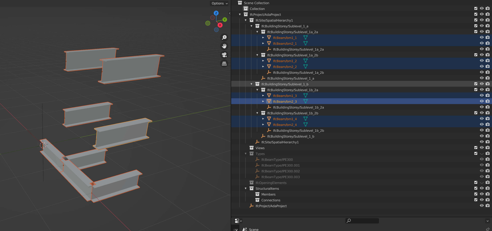
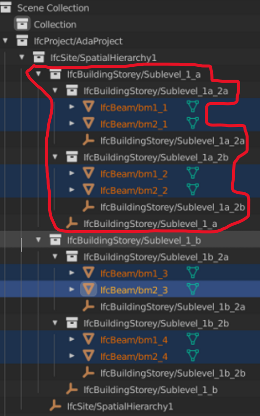

## Spatial Query

For reference, here is [the ESDL schema](default.esdl) for this Spatial Query 
investigation.

### Motivation & Goal
`Motivation:` Large IFC models contain spatial hierarchies that can hold
thousands of geometry elements underneath each top level. 
Each top-level can contain elements arranged in many spatial layers each branching down into separate sublayers. 
Needless to say, having the ability to slice through the spatial hierarchy to extract only the data
you want is necessary in order to prevent data-size bottlenecks.

`The goal:` The ability to return all elements below a specific spatial element.

### Scenario

In this scenario the aim is to find all sub-elements of the spatial element named `Sublevel_1_a` in the 
spatial hierarchy and create a new IFC file from it. For this purpose a test IFC file `SpatialHierarchy1.ifc` is created.

The IFC model contains 8 `IfcBeam` elements, 6 `IfcBuildingStorey` elements, 1 `IfcSite` and 1 `IfcProject`.
The model is shown in the figure below taken from Blender using the addon BlenderBIM  




The spatial query should return in addition to the spatial `IfcBuildingStorey` element `Sublevel_1_a`, 
4 `IfcBeam` elements; `bm_1_1`, `bm_2_1` ,`bm_1_2`, `bm_2_2` and the 
sublevels `IfcBuildingStorey` elements `Sublevel_1a_2a` & `Sublevel_1a_2b`. 

To be able to find and merge this spatial element at the correct level at a later stage, 
the parent `IfcSite` element `SpatialHierarchy1` & 
`IfcProject` element `AdaProject` should also be included in the element export. 



### Query Overview

The overall strategy is to first get the entire spatial hierarchy where it returns all the elements with 
their respective name (`Name`), EdgeDB uuid (`id`) and ESDL/IFC class name (``__type__ : { name }``). 

Upon receiving the returned data, python is used on the client side to slice through the spatial hierarchy and 
build additional queries to extract all relevant objects and properties within the specified spatial hierarchy. 

### Query 1 -> Get the entire spatial hierarchy

To get all the necessary classes for describing the spatial hierarchy and their elements, 
the following query is performed:

```
SELECT {
    spatial_stru := (
        SELECT IfcRelContainedInSpatialStructure {
            id,
            RelatingStructure : { Name, id, __type__ : { name } },
            RelatedElements : { Name, id, __type__ : { name } }
        }
    ),
    rel_aggs := (
        SELECT IfcRelAggregates {
            id,
            RelatingObject : { Name, id, __type__ : { name } },
            RelatedObjects : { Name, id, __type__ : { name } }
        }
    ) 
}
```

which returns the following:

(fyi -> the resulting json is shortened for the sake of readability in this document.
See [result.json](result.json) for the entire output.

```
{
  'spatial_stru': [
    {
      'id': 'fb6d6d2a-f2be-11ec-ac74-23608326f6e7',
      'RelatingStructure': {
        'Name': 'Sublevel_1a_2a',
        'id': 'f6980fd0-f2be-11ec-ac74-abe5fe6aa302',
        '__type__': {
          'name': 'default::IfcBuildingStorey'
        }
      },
      'RelatedElements': [
        {
          'Name': 'bm1_1',
          'id': 'f96474a6-f2be-11ec-ac74-e796fcfa53d3',
          '__type__': {
            'name': 'default::IfcBeam'
          }
        },
        {
          'Name': 'bm2_1',
          'id': 'f9835114-f2be-11ec-ac74-d7a2757c5f6b',
          '__type__': {
            'name': 'default::IfcBeam'
          }
        }
      ]
    },
... 
'rel_aggs': [
    {
      'id': 'f64d4aea-f2be-11ec-ac74-4bd25461394f',
      'RelatingObject': {
        'Name': 'AdaProject',
        'id': 'f2ef5848-f2be-11ec-ac74-d764e1155ac1',
        '__type__': {
          'name': 'default::IfcProject'
        }
      },
      'RelatedObjects': [
        {
          'Name': 'SpatialHierarchy1',
          'id': 'eebd84e8-f2be-11ec-ac74-e7851f987412',
          '__type__': {
            'name': 'default::IfcSite'
          }
        }
      ]
    },
...
```

### Query 2 -> Getting all relevant data associated to the returned list of classes

With the exported [results.json](results.json) python is used to find parent/children relationships of 
the spatial hierarchy and slice out all sub-elements and related parent elements of the `Sublevel_1_a` spatial element. 

#### Alternative "A" -> Loop over the returned spatial classes and build nested select queries. 

Alternative "A" is to Loop over each element and construct a nested query specifying all nested sub-objects and their 
properties. The IfcOpenShell schema is used to find all related classes hiding in the nested 
chain of properties on the different IFC object types. 

However, it will be shown that these queries quickly becomes very large and complex. 
Also there is the issue when it comes to properties that links to abstract object supertypes with many subtypes which
will further increase size and complexity of the query string. Lastly this approach will not consider duplication of
objects found within the nested chain of object properties. 

An example of a nested query is shown for a single `IfcBuildingStorey` class to illustrate just how many nested object 
link relations there can be in a typical IFC class.

```
SELECT ( 
    (
        SELECT IfcBuildingStorey {
            GlobalId,
            OwnerHistory : {
                OwningUser : {
                    ThePerson : {
                        Identification,
                        FamilyName,
                        GivenName,
                        MiddleNames,
                        PrefixTitles,
                        SuffixTitles,
                        Roles : {
                            Role,
                            UserDefinedRole,
                            Description
                        },
                        Addresses : {
                            Purpose,
                            Description,
                            UserDefinedPurpose
                        }
                    },
                TheOrganization : {
                    Identification,
                    Name,
                    Description,
                    Roles : {
                        Role,
                        UserDefinedRole,
                        Description
                    },
                    Addresses : {
                        Purpose,
                        Description,
                        UserDefinedPurpose
                    }
                },
                Roles : {
                    Role,
                    UserDefinedRole,
                    Description
                }
            },
            OwningApplication : {
                ApplicationDeveloper : {
                    Identification,
                    Name,
                    Description,
                    Roles : {
                        Role,
                        UserDefinedRole,
                        Description
                    },
                    Addresses : {
                        Purpose,
                        Description,
                        UserDefinedPurpose
                    }
                },
                Version,
                ApplicationFullName,
                ApplicationIdentifier
            },
            State,
            ChangeAction,
            LastModifiedDate,
            LastModifyingUser : {
                ThePerson : {
                    Identification,
                    FamilyName,
                    GivenName,
                    MiddleNames,
                    PrefixTitles,
                    SuffixTitles,
                    Roles : {
                        Role,
                        UserDefinedRole,
                        Description
                    },
                    Addresses : {
                        Purpose,
                        Description,
                        UserDefinedPurpose
                    }
                },
                TheOrganization : {
                    Identification,
                    Name,
                    Description,
                    Roles : {
                        Role,
                        UserDefinedRole,
                        Description
                    },
                    Addresses : {
                        Purpose,
                        Description,
                        UserDefinedPurpose
                    }
                },
                Roles : {
                    Role,
                    UserDefinedRole,
                    Description
                }
            },
            LastModifyingApplication : {
                ApplicationDeveloper : {
                    Identification,
                    Name,
                    Description,
                    Roles : {
                        Role,
                        UserDefinedRole,
                        Description
                    },
                    Addresses : {
                        Purpose,
                        Description,
                        UserDefinedPurpose
                    }
                },
                Version,
                ApplicationFullName,
                ApplicationIdentifier
            },
            CreationDate
        },
        Name,
        Description,
        ObjectType,
        ObjectPlacement : {id, __type__ : { name }},
        Representation : {
            Name,
            Description,
            Representations : {
                ContextOfItems : {
                    ContextIdentifier,
                    ContextType
                },
                RepresentationIdentifier,
                RepresentationType,
                Items : {id, __type__ : { name }}
            }
        },
        LongName,
        CompositionType,
        Elevation
    } filter .id = <uuid>'fe0e2222-f601-11ec-9720-ffa48bb2d7b1'),
    ...
```

By close inspection it is observed in the above query that certain elements only refer to the related object's `id` and
`__type__ : { name }` (IFC class name). There are in fact 2 properties where this occurs:

* `Items : {id, __type__ : { name }}`
* `ObjectPlacement : {id, __type__ : { name }}`


`Items` is a property on the `IfcRepresentation` class that links to multiple `IfcRepresentationItem` elements.
The `IfcRepresentationItem` class is an abstract class with __153 subtypes__ whereas 126 of these are not abstract 
classes. 

In order to specify the properties of a subclass it is possible to use EdgeDB's concept of 
[polymorphic query](https://www.edgedb.com/docs/edgeql/select#polymorphic-fields) and use a 
`[is subclass].subtype_parameter` operator to extract subtype properties _if_ they exist. However, when the total
number of subtypes > 100, the sheer number of these operators suddenly become impractical and makes the total insert
string difficult to read.


Note! At the time of writing `"splats"` in shapes are not yet supported 
(ref https://github.com/edgedb/edgedb/issues/180). 
What that means that the user has to know all property types of all 
objects and objects found in the chains of nested object properties and create rather complex queries.


#### Alternative "B" -> Loop over the returned spatial classes and return all related uuid's before doing a 3rd query

As observed in Alternative "A" the sheer size of the insert string became impractical when attempting to insert all
the nested object properties in a single statement.

To alleviate this complexity, the 2nd query focuses on finding all related objects and returns only object id `uuid` and 
class type `__type__ : { name }`.

With this approach you do have to add a 3rd query, but you will be able to define only 1st level properties, thus
reducing the overall complexity of the query. It also provides the added bonus of doing some processing in python on 
the client side to remove any duplicate object references, so the final query is as efficient as possible. 