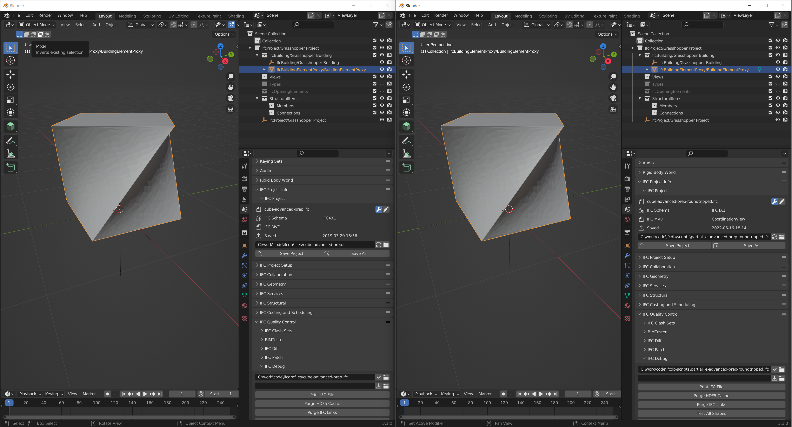

# Basic Insertion Validation

[Back to Main Page](../index.md)


Validation is done by roundtripping various IFC files and ensuring that whatever is returned is equal
to what was sent.

## Roundtripping the IFC file `cube-advanced-brep.ifc` 

(left: original, right: roundtripped through EdgeDB)



To insert the following `IfcBSplineSurfaceWithKnots`:

`"#36=IfcBSplineSurfaceWithKnots(3,1,((#48,#49),(#50,#51),(#52,#53),(#54,#55)),.UNSPECIFIED.,.F.,.F.,.F.,(4,4),(2,2),(0.,1224.74487139159),(3.,4.),.UNSPECIFIED.)"`

I ended up with the following automatically generated insert statement.

```

WITH
    ifc_48 := (INSERT IfcCartesianPoint {  Coordinates := [-0.5, 0.5, 0.0]}),
    ifc_49 := (INSERT IfcCartesianPoint {  Coordinates := [-0.5, -0.5, 0.0]}),
    IfcCartesianPointList_1 := (INSERT IfcCartesianPointICList { IfcCartesianPoints := {ifc_48,ifc_49} }),
    ifc_50 := (INSERT IfcCartesianPoint {  Coordinates := [-0.561004233964073, 0.27232909936926, 0.333333333333333]}),
    ifc_51 := (INSERT IfcCartesianPoint {  Coordinates := [-0.27232909936926, -0.561004233964073, 0.333333333333333]}),
    IfcCartesianPointList_2 := (INSERT IfcCartesianPointICList { IfcCartesianPoints := {ifc_50,ifc_51} }),
    ifc_52 := (INSERT IfcCartesianPoint {  Coordinates := [-0.622008467928146, 0.0446581987385206, 0.666666666666667]}),
    ifc_53 := (INSERT IfcCartesianPoint {  Coordinates := [-0.0446581987385206, -0.622008467928146, 0.666666666666667]}),
    IfcCartesianPointList_3 := (INSERT IfcCartesianPointICList { IfcCartesianPoints := {ifc_52,ifc_53} }),
    ifc_54 := (INSERT IfcCartesianPoint {  Coordinates := [-0.683012701892219, -0.183012701892219, 1.0]}),
    ifc_55 := (INSERT IfcCartesianPoint {  Coordinates := [0.183012701892219, -0.683012701892219, 1.0]}),
    IfcCartesianPointList_4 := (INSERT IfcCartesianPointICList { IfcCartesianPoints := {ifc_54,ifc_55} }),
SELECT (INSERT IfcBSplineSurfaceWithKnots {
    UDegree := 3,
    VDegree := 1,
    ControlPointsList := {IfcCartesianPointList_1,IfcCartesianPointList_2,IfcCartesianPointList_3,IfcCartesianPointList_4},
    SurfaceForm := 'UNSPECIFIED',
    UClosed := False,
    VClosed := False,
    SelfIntersect := False,
    UMultiplicities := (4, 4),
    VMultiplicities := (2, 2),
    UKnots := (0.0, 1224.74487139159),
    VKnots := (3.0, 4.0),
    KnotSpec := 'UNSPECIFIED'
   }
)
```

And the class definitions are like this:

```
type IfcCartesianPointICList { required multi link IfcCartesianPoints -> IfcCartesianPoint }

abstract type IfcBSplineSurface extending IfcBoundedSurface {
    required property UDegree -> int64;
    required property VDegree -> int64;
    required multi link ControlPointsList -> IfcCartesianPointICList;
    required property SurfaceForm -> str {
        constraint one_of ('CONICAL_SURF','CYLINDRICAL_SURF','GENERALISED_CONE','PLANE_SURF','QUADRIC_SURF','RULED_SURF','SPHERICAL_SURF','SURF_OF_LINEAR_EXTRUSION','SURF_OF_REVOLUTION','TOROIDAL_SURF','UNSPECIFIED');
    };
    required property UClosed -> bool;
    required property VClosed -> bool;
    required property SelfIntersect -> bool;
}

type IfcBSplineSurfaceWithKnots extending IfcBSplineSurface {
    required property UMultiplicities -> tuple<int64, int64>;
    required property VMultiplicities -> tuple<int64, int64>;
    required property UKnots -> tuple<float64, float64>;
    required property VKnots -> tuple<float64, float64>;
    required property KnotSpec -> str {
        constraint one_of ('PIECEWISE_BEZIER_KNOTS','QUASI_UNIFORM_KNOTS','UNIFORM_KNOTS','UNSPECIFIED');
    };
}
```