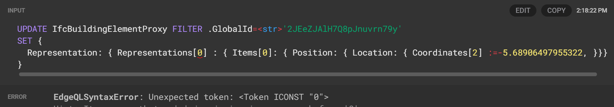
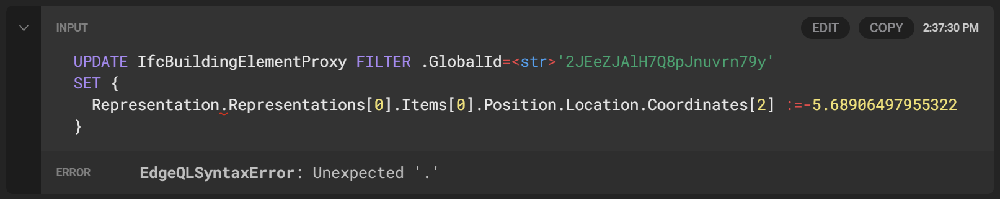
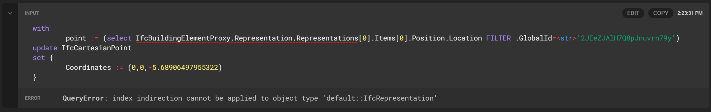

# EdgeDB update statement issue 

[Back to Main Page](../index.md)

So I started to look into how I make changes to nested properties using EdgeQL.

```{note}
In the following examples some intermediate abstract classes have been removed for purposes of simplifying this example, 
and the classes shown here is therefore not following the IFC standard accurately 
```

The property subject to change is an array float property @index=2 on the `Coordinates` property in 
a `IfcCartesianPoint` class.

```
type IfcCartesianPoint extending IfcPoint {
    required property Coordinates -> array<float64>{
        constraint expression on (len(__subject__) = 1 or len(__subject__) = 2 or len(__subject__) = 3)
    };
}
```

The `IfcCartesianPoint` is a property attached quite far down a nested path from a "rooted" element type 
`IfcBuildingElementProxy`.

```
type IfcBuildingElementProxy extending IfcProduct {
    property PredefinedType -> str {
        constraint one_of ('COMPLEX','ELEMENT','NOTDEFINED','PARTIAL','PROVISIONFORSPACE','PROVISIONFORVOID','USERDEFINED');
    };
}

abstract type IfcProduct extending IfcObject {
    link ObjectPlacement -> IfcObjectPlacement;
    link Representation -> IfcProductRepresentation;
}

abstract type IfcProductRepresentation  {
    property Name -> str;
    property Description -> str;
    required multi link Representations -> IfcRepresentation;
}

abstract type IfcRepresentation  {
    required link ContextOfItems -> IfcRepresentationContext;
    property RepresentationIdentifier -> str;
    property RepresentationType -> str;
    required multi link Items -> IfcRepresentationItem;
}

abstract type IfcRepresentationItem  {
}

type IfcExtrudedAreaSolid extending IfcSweptAreaSolid {
    required link ExtrudedDirection -> IfcDirection;
    required property Depth -> float64;
}

abstract type IfcSweptAreaSolid extending IfcSolidModel {
    required link SweptArea -> IfcProfileDef;
    link Position -> IfcAxis2Placement3D;
}

type IfcAxis2Placement3D extending IfcPlacement {
    link Axis -> IfcDirection;
    link RefDirection -> IfcDirection;
}

abstract type IfcPlacement extending IfcGeometricRepresentationItem {
    required link Location -> IfcCartesianPoint;
}
```

So in my first attempt I thought I could simply filter the desired root class and set the property directly like this 

```
UPDATE IfcBuildingElementProxy FILTER .GlobalId=<str>'2JEeZJAlH7Q8pJnuvrn79y'
SET { 
  Representation: { Representations[0] : { Items[0]: { Position: { Location: { Coordinates[2] :=-5.68906497955322, }}}}}
}
```

However, that failed with the following error:



I then tried by massaging the syntax a little:

```
UPDATE IfcBuildingElementProxy FILTER .GlobalId=<str>'2JEeZJAlH7Q8pJnuvrn79y'
SET { 
  Representation.Representations[0].Items[0].Position.Location.Coordinates[2] :=-5.68906497955322
}
```
which didn't like my `.` :(



Then inspired by a [with block example](https://www.edgedb.com/docs/edgeql/update#with-blocks) from the docs I tried 
the following

```
with
	point := (select IfcBuildingElementProxy.Representation.Representations[0].Items[0].Position.Location FILTER .GlobalId=<str>'2JEeZJAlH7Q8pJnuvrn79y')
update IfcCartesianPoint
set {
	Coordinates := (0,0,-5.68906497955322)
}
```

That resulted in a different error



Then I tried a lot of different stuff and ended up with something that worked:

```
with
  point := (select (select IfcBuildingElementProxy FILTER .GlobalId=<str>'3vJeEVZYzA3vP81uCmY9l4').Representation.Representations.Items[is IfcExtrudedAreaSolid].Position.Location)
UPDATE point
SET { 
  Coordinates := [0,0, -5.68906497955322]
}
```


But it only works because there is only 1 element in the `Representation` multi link and the 1 element of type 
`IfcExtrudedAreaSolid` in the `Items` multi link.

What I would want to do is this:

```
with
  point := (select (select IfcBuildingElementProxy FILTER .GlobalId=<str>'3vJeEVZYzA3vP81uCmY9l4').Representation.Representations[0].Items[0][is IfcExtrudedAreaSolid].Position.Location)
UPDATE point
SET { 
  Coordinates := [0,0, -5.68906497955322]
}
```

I've asked the edgedb devs on help here. Hopefully I'll get some answers!

With help from the EdgeDB devs I made this work using the following pattern:

```
with
  root := (select IfcBuildingElementProxy FILTER .GlobalId=<str>'3vJeEVZYzA3vP81uCmY9l4'),
  lvl1 := (select array_agg(root.Representation.Representations)[0][is IfcShapeRepresentation]),
  lvl2 := (select array_agg(lvl1.Items)[0][is IfcExtrudedAreaSolid]),
select {
  update1 := (
    with
      lvl3 := (select lvl2.Position.Location),
    UPDATE lvl3
    SET {
      Coordinates := [.Coordinates[0], .Coordinates[1], -5.68906497955322]
    }),
  update2:= (
  with
    lvl3 := (select lvl2.Position.RefDirection),
  UPDATE lvl3
  SET {
    DirectionRatios := [-1.0, .DirectionRatios[1], .DirectionRatios[2]]
  })
}
``` 


