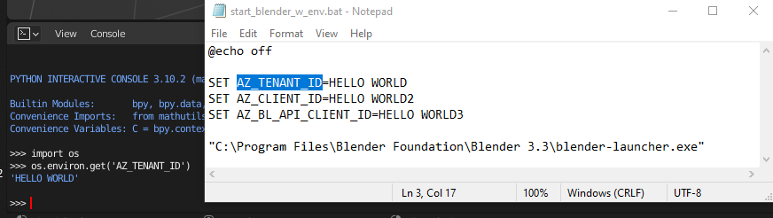

# IFC Database Client for Blender

Tested together with 

    BlenderBIM==v0.0.220703

**Note!** 

If you want to use Azure Authentication then these environmental variables needs to be set up on your computer before 
starting Blender:

    AZ_TENANT_ID=<Azure Tenant ID>
    AZ_CLIENT_ID=<Base App Registration Client ID>
    AZ_BL_API_CLIENT_ID=<Blender Client Specific App Registration Client ID>

 
You can create a batch file for starting blender and automatically add these 

or if you prefer to have your env variables in a separate .env file (that is ignored by git) 
you can do something like this

    @echo off

    if exist blender_client.env for /f "delims=" %%i in (blender_client.env) do set %%i
    
    "C:\Program Files\Blender Foundation\Blender 3.3\blender-launcher.exe"

_ie. the env variables are stored in a separate file called **blender_client.env**_